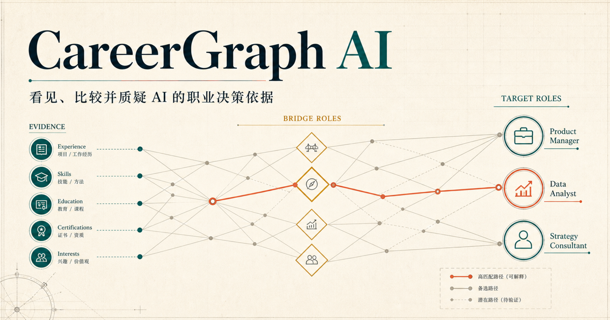
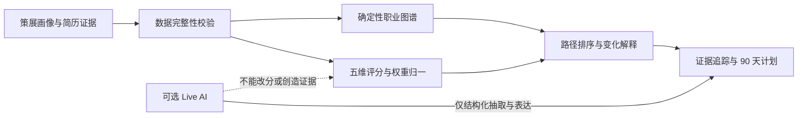

# CareerGraph AI

CareerGraph AI 是一个面向 AI 转型者的可解释职业跃迁实验室。它把候选人的具体经历转成可核验的能力证据，在策展职业图谱中比较多条转型路径，并把结论落到 90 天行动计划。

核心主张：**看见、比较并质疑 AI 的职业决策依据。**



## 为什么做这个作品

这个作品根据 Yueer W. 的背景设计，集中展示四类能力：

- 职业与人才场景的领域理解；
- NLP、职业网络、因果推断和大规模数据分析；
- 把研究方法转成可交互产品的能力；
- 对 AI 证据边界、失败降级和用户决策权的判断。

它不是简历关键词匹配器，也不宣称预测实时招聘市场。所有演示数据均为经过说明的本地策展数据。

## 核心体验

- 画像面板：8 条简历证据和 7 项核心能力；
- 职业图谱：当前角色、桥接岗位和目标 AI 岗位；
- 三条路径：AI 产品经理、People Analytics 数据科学家、AI 解决方案顾问；
- 五维评分：技能迁移、职业邻近、证据强度、AI 杠杆、转型速度；
- 情景模拟：最快进入 AI、最大化技术深度、发挥商业优势；
- 依据抽屉：证据、评分、90 天行动计划和模型说明；
- 三分钟讲解：5 步内置面试演示；
- 双模式边界：默认稳定演示完整离线运行，可选 Live AI 仅做结构化抽取和语言表达。

## 技术结构



- React 19 + TypeScript + Vinext；
- 原生 SVG 职业图谱；
- 纯函数领域引擎，UI 不复制评分规则；
- Vitest、Testing Library 和 Node 测试；
- Cloudflare/Sites 构建与部署；
- 无远程字体、无客户端密钥、无数据库依赖。

## 本地运行

需要 Node.js 22.13 或更高版本。

```bash
npm install
npm run dev
```

默认本地地址为 `http://localhost:3000/`。

## 验证

```bash
npm run test:all
npm run lint
```

`test:all` 会运行生产构建、数据/评分/降级测试、服务端渲染测试和整页交互测试。

## 面试演示

页面右上角的“开始三分钟讲解”可直接完成内置演示。更完整的话术、点击顺序和岗位追问准备见：

- [`../docs/interview-demo.md`](../docs/interview-demo.md)
- [`../docs/verification.md`](../docs/verification.md)

## AI 与数据边界

- 路径分数由本地确定性引擎计算；
- Live AI 不能修改组件分数或总分；
- 模型不能创造不存在的简历证据；
- schema 校验失败时保留原始输入并回退稳定模式；
- 页面中的图谱不代表实时市场规模，分数也不是录用概率；
- 内置画像使用 `Yueer W.`，不包含手机号或邮箱。

## 目录

```text
app/
  components/        画像、图谱、路径、抽屉和讲解组件
  lib/               策展数据与职业决策引擎
  CareerGraphApp.tsx 整页状态协调
tests/               领域、SSR 与交互验证
public/og.png         社交预览封面
```
